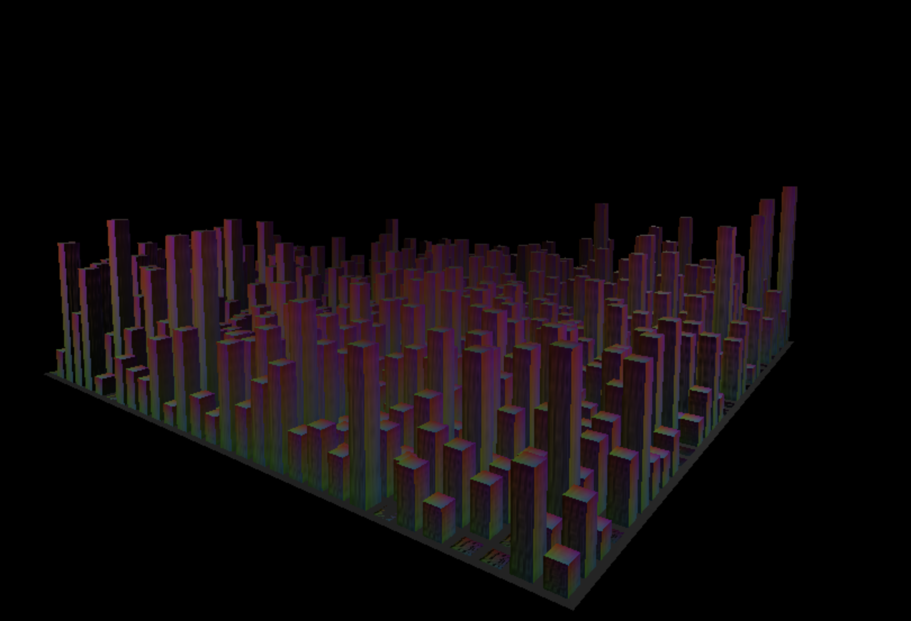

Part 2a: 

Part 2b: 

Part 2c: The buildings in Wan Chai are very colorful, so I wanted to make a city with colorful buildings. To accomplish this I used a raibow picture and applied it as a texure to each cube/building

Lab Partner - My lab partner did not repsond by the time I wanted to submit.